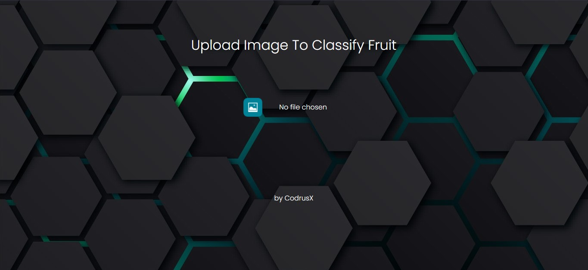
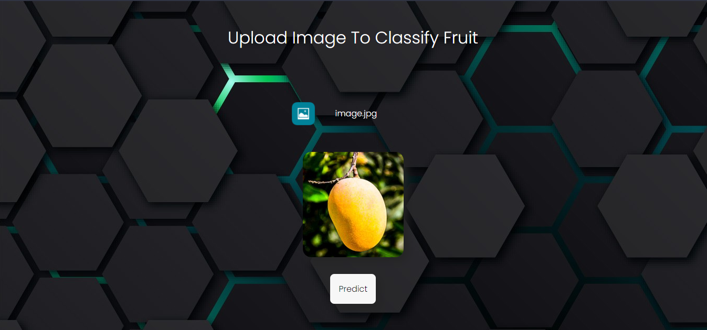

<!--ts-->

-   [Chamasifier](#chamasifier?)
    -   [Features](#features)
    
-   [Team Members](#team-members)
-   [Tead ID](#team-id)
-   [Link to product walkthrough](#link-to-product-walkthrough)
-   [How it Works ?](#how-it-Works-?)
-   [Libraries used](#libraries-used)
-   [How to configure](#how-to-configure)
-   [How to Run](#-how-to-Run)


<!--te-->

# Chamasifier

[CHAMASIFIER](http://ec2-3-17-203-44.us-east-2.compute.amazonaws.com:8080/) a.k.a CHA-kka MA-nga clas-SIFIER is a machine learning project which can identify the two of the fruits 'Chacka' and 'Manga'(JackFruit and Mango).The ML algorithm used here is Convolutional Neural Network. This algorithm can classify images based on the features.Tensorflow library is used here for the purpose of creation,training and testing of the model.For the website implementation we used the flask library of python.

#### Features

The main features of Chamasifier are,

-   Trained with over 600 images,
-   has an accuracy of ~0.7,
-   it has 3 convolution layers and 3 pooling layers,
-   2 dense hidden layers,
-   rmsprop optimization.

## Team members

[xidhu](https://github.com/xidhu)

[Arjun-K-S](https://github.com/Arjun-K-S)

[graison-s](https://github.com/graison-s)

## Team Id

BFH/recVTOJ0fhTpNx2Tm/2021

## Link to product walkthrough

link here

## How it Works ?

1. Explaining the working of project

<iframe src="https://www.loom.com/embed/3b1e292e660b4abebf5bf50b7d0196a3" frameborder="0" webkitallowfullscreen mozallowfullscreen allowfullscreen style="position: absolute; top: 0; left: 0; width: 100%; height: 100%;"></iframe>

## Libraries used

The various libraries used in the project are listed in the [requirements.txt](requirements.txt) file.

## How to configure

Python and pip should be installed in the system.
Can be installed by using

```sudo apt install python python-pip```

Other requirements are written in the [requirements.txt](requirements.txt) file.
It can be installed using 

```pip install -r requirements.txt```

## How to Run

<!--ts-->
- Open [Chamasifier](http://ec2-3-17-203-44.us-east-2.compute.amazonaws.com:8080/)



- Upload the picture of a jackfruit or a mango.



- Get the result, it's as simple as that


<!--te-->
